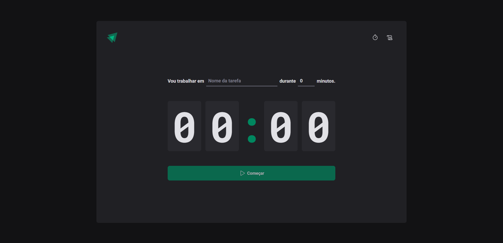

<h1>
React Timer
</h1>




## About:

Stopwatch web application where the client can register a new task and set up a time for it execution. <br>
The application also have a indicator where the user can follow if the time is running, paused ou finished. <br>

Web application built following the Ignite Bootcamp, provided by online programming school [Rocketseat](https://www.rocketseat.com.br/). <br>


**Demo**: https://react-timer-six.vercel.app/


## User actions:

- Can register a new task (form above the timer);
- Can set a time (multiple of 5);
- Can navigate between the homepage (stopwatch) and the task list;
- Can follow the status of the time according to the color.


## Main tools:

- [React](https://react.dev/) ```(v18.02)``` ;
- [Typescript](https://www.typescriptlang.org/docs/) ```(v4.6)```;
- [Styled-components](https://styled-components.com/) ```(v5.3)```;

## Package manager:

- [npm](https://www.npmjs.com/) ```(v9.5)```;
- [vite](https://vitejs.dev/);

## Running locally:

> Before installing the project, make sure that you have [Node](https://nodejs.org/en) and [GIT](https://git-scm.com/) already installed in your machine.

1. Open your favorite terminal.

2. Run the following commands:

```shell
# clone repository:
git clone git@github.com:celiovjunior/react-timer.git

# go to the project folder:
cd react-timer

# install the necessary dependencies:
npm install

# execute the project:
npm run dev
```

Application will start at port http://localhost:5173
